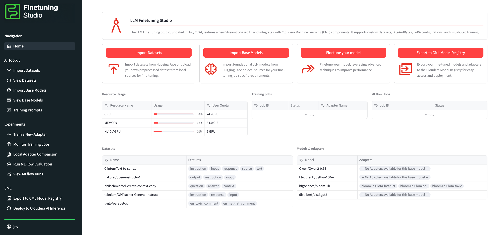

# Fine Tuning Studio

> IMPORTANT: Please read the following before proceeding. This AMP includes or otherwise depends on certain third party software packages. Information about such third party software packages are made available in the notice file associated with this AMP. By configuring and launching this AMP, you will cause such third party software packages to be downloaded and installed into your environment, in some instances, from third parties' websites. For each third party software package, please see the notice file and the applicable websites for more information, including the applicable license terms. If you do not wish to download and install the third party software packages, do not configure, launch or otherwise use this AMP. By configuring, launching or otherwise using the AMP, you acknowledge the foregoing statement and agree that Cloudera is not responsible or liable in any way for the third party software packages.

## Getting Started

Want to hop right in? Try the [end-to-end tutorial on training an SQL adapter](docs/tutorials/train_an_sql_peft_adapter.md), which requires no prior knowledge of the Studio!

* [Technical Overview](docs/techinical_overview.md)
* [User Guide](docs/user_guide.md)

## About this AMP

The CML Fine Tuning Studio is a Cloudera-developed AMP that provides users with an all-encompassing application and “ecosystem” for managing, fine tuning, and evaluating LLMs. This application is a launcher that helps users organize and dispatch other CML Workloads (primarily CML Jobs) that are configured specifically for LLM training and evaluation type tasks.

## High Level Features

* Import datasets, models, model PEFT adapters, and other components into the Application's UI for easy tracking of project resources
* Design training prompt and inference prompt templates to be used to augment datasets for training, inference, and evaluation purposes
* Launch fine tuning jobs and MLFlow evaluation jobs directly from the UI, which in turn kicks off appropriate CML Workloads
* Locally compare generation results between different PEFT adapters for a given base model
