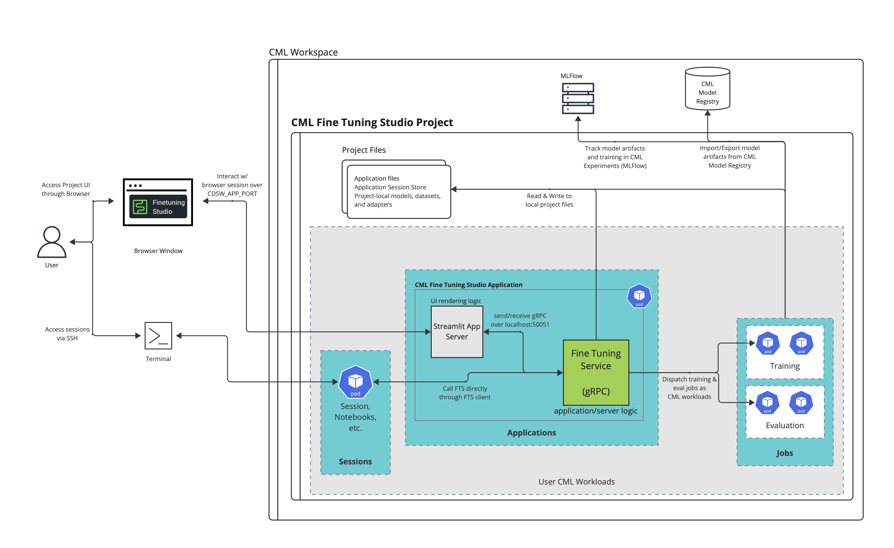

# CML Fine Tuning Studio: Technical Overview

## Scope

This document outlines the technical components of the CML Fine Tuning Studio product. This is designed to be read by users of the tool that want deeper understanding of the framework behind the tool, or developers who are onboarding to the tool’s architecture and who would like to extend features in the AMP.

For users who just want to interact with the vanilla application, please see the [User Guide](user_guide.md).

For users who want to take the next step and start developing, see our [Developing Guidelines](../DEVELOPMENT.md).

## Introduction

The CML Fine Tuning Studio (will shorthand as the “Studio” through the document) is a Cloudera-developed AMP that provides users with an all-encompassing application and “ecosystem” for managing, fine tuning, and evaluating LLMs. This application is a “launcher” that helps users organize and dispatch other CML Workloads (primarily CML Jobs) that are configured specifically for LLM training and evaluation type tasks.




### Components

The AMP itself consists of multiple different components.

* **Presentation Layer:** Server side client UI that can be accessed through the application’s `CDSW_APP_PORT`. The UI rendering framework is [Streamlit](https://streamlit.io/), a powerful python framework for building data science apps.  
* **Application Layer:** A gRPC server (sometimes referred to as *Fine Tuning Service*, or sometimes abbreviated as FTS when not talking about Fine Tuning Studio as a whole) that hosts all logic necessary for dispatching and tracking training jobs, evaluation jobs, and manipulating other training data (prompts, dataset locations, etc.). This server can be accessed directly by using the `FineTuningStudioClient` anywhere within the AMP’s project. This gRPC server can be thought of as generally a stateless microservice.  
* **Data Layer**: An SQL database, SQL engie, and session connection pool running in the same process as the gRPC server. The SQL engine is [SQLite](https://www.sqlite.org/), which writes all database stored data into a database file in the user’s project (currently defaulted to `.app/state.db`). [SQLAlchemy](https://docs.sqlalchemy.org/en/20/tutorial/) is also employed to map python data classes to SQL tables using ORM.  
* **Utilities**: A python library, `ft`, which contains a full suite of API types available with `from ft.api import *`, as well as a client class which can be used to access just the FTS server at `from ft.client import FineTuningStudioClient`, and several helping classes and functions that contain the application logic of the gRPC server, and several other critical components for Fine Tuning Studio to operate smoothly.  
* Flexible template CML Job definitions for fine tuning and evaluation, with an option through the `fts.StartFineTuningJob(...)` API to also provide a user-created script. The template jobs are also responsible for dispatching and organizing distributed training jobs.

-----

## Project Security and Scope

When deploying this AMP to a user’s workspace, the application exists primarily within the scope of a user’s project that is created for the AMP. The project is created as a **private** project by default, which means that other CML users within the CML workspace will not be able to access your specific instance of the application unless the application is shared with another user. If the application is shared with another user, this application does not claim any concurrency promises when multiple different users (multiple different browser sessions) are manipulating project files at the same time. There are a few components that this application interacts with that don’t explicitly live within the scope of a CML project:

* When deploying models to the CML model registry, models are deployed to a workspace-scoped model registry. If a user does not have access to the workspace’s Model Registry, then Model Registry import/export features will not work.  
* When tracking models with MLFlow, model artifacts and metrics are sent to the workspace’s MLFlow tracking server. As with Model Registry, this is scoped to whatever CML Experiments/MLFLow permissions the user has available/

-----

## Initialization

The Fine Tuning Studio is deployed as an AMP into a user project. The AMP initializes and configures itself following these loose steps:

* Several dependencies are installed from the provided `requirements.txt` into the user project filesystem.  
* The `ft` package that ships with this AMP is installed into the local python’s `pip` in development mode using `pip install -e .`.  
* Template jobs are created for the base fine tuning script and the base evaluation job script. When actual training and evaluation jobs are dispatched, this template job is copied to a new job definition with optionally updated cpu/gpu/mem, script, and job arguments.  
* A pod is initialized for the application server (engine) to run.   
* A gRPC server is initialized as a subprocess in this pod and runs as a `nohup` in the background. The IP address (the k8s address provided to the pod) and the gRPC port (`50051` by default) of the gRPC server are added as project environment variables. This way, every time a new workload is created (either a session, job, or other), the Fine Tuning Studio python client can detect where to access the application server.  
* An SQLite engine is instantiated in the same process (and in fact, the same gRPC `Servicer` class) as the gRPC server. The SQLite data store points to a project file, `.app/state.db`, which is an SQLite database which ships with some default datasets, prompts, and models/adapters.  
* A Streamlit server is initialized and served on `CDSW_APP_PORT` which is responsible for providing a client UI for users who don’t want to interact with the FTS server directly.

-----

## Streamlit UI

This AMP utilizes [Streamlit](https://streamlit.io/) for UI design. The entrypoint for the Streamlit app can be found in `main.py`. The actual Streamlit app itself is served on the `CDSW_APP_PORT` and is available at the specified application’s domain.

```py
# Example initialization command of a streamlit server
!streamlit run main.py --server.port $CDSW_APP_PORT --server.address 127.0.0.1
```

Streamlit “pages” (frontend UI components) are all stored in the `pgs/` directory of the AMP. All of the pages in this application contain some logic that interacts with the FTS gRPC server to send/receive information that is entered in the UI. 

Streamlit is not a typical frontend UI framework. Because it was designed for ease-of-use and simplicity for data science projects, there are some limitations. For example, every interaction within the UI will lead to a complete re-rendering of the whole page (unless a user annotates certain sections of a page with a `@streamlit.fragment` decorator). If working with Streamlit components, it’s highly recommended to read through [Streamlit’s execution model](https://docs.streamlit.io/develop/concepts/architecture) for better understanding on how Streamlit works.

### Why Streamlit?

Streamlit is a powerful data science tool that allows developers to quickly spin up server-side rendered apps that are written in Python. The server is easy to set up and avoids having to stand up a full NodeJS server or otherwise alongside our Python runtimes. The tool self-proclaims its ease-of-use specifically for designing data science and AI/ML applications. The Streamlit server itself is also very portable.

-----

## Fine Tuning Service (gRPC server)

At the center of the Fine Tuning Studio is a stateless gRPC service that serves application logic and a connection point between project data, application metadata, and dispatched training and evaluation data. Users can interact with the service directly through client classes. In fact, the Streamlit frontend employes the provided `FineTuningStudioClient` client in order to send requests to the server.

The entire gRPC server, and all of the request and response messages that define the API surface of the server, are defined in a `protobuf` definition file, which can be found currently in `ft/proto/fine_tuning_studio.proto`. The API surface types can be found in `ft.api.*` too, if you’re working on writing scripts that access the client directly. All of the gRPC server commands are accessible through an instance of the `FineTuningStudioClient` class, which derives from the protobuf `Stub` (an auto-generated client-type class to interface with the gRPC service).

Using the FTS client directly provides a lightweight approach to dispatch and organize training jobs right from a notebook or script. If the notebook is running in the same project as the FTS application, the FTS client will automatically detect the relevant networking necessary to have access to the gRPC server. Below is a brief example of how to use some components of the client.

```py
from ft.api import *
from ft.client import FineTuningStudioClient

# Create a client to access the FTS server
fts = FineTuningStudioClient()

# List available datasets that are loaded into FTS. Some helper 
# methods are added to the client, like get_datasets() and get_adapters(),
# etc., which are wrappers to the actual gRPC service class
datasets: list[DatasetMetadata] = fts.get_datasets()

# Directly use all of the gRPC service calls defined in the stub 
# which is directly inherited by the client.
res: GetDatasetResponse = fts.GetDataset(GetDatasetRequest(id="my_dataset_id")))
dataset: DatasetMetadata = res.dataset

# Load in new models and other components into FTS.
new_model: ModelMetadata = fts.AddModel(
  AddModelRequest(
    type=ModelType.HUGGINGFACE,
    huggingface_name="bigscience/bloom-1b1"
  )
).model # .model is necessary to unwrap the AddModelResponse() object

# Kick off distributed fine tuning jobs from anywhere.
job: FineTuningJobMetadata = fts.StartFineTuningJob(
  StartFineTuningJobRequest(
    model_id = new_model.id,
    dataset_id = dataset.id,
    prompt_id = ...,
    num_epochs = 1,
    training_arguments = json.dumps(...)
  )
).fine_tuning_job # .fine_tuning_job is necessary to unwrap StartFineTuningJobResponse()
```

### Why gRPC?

The Fine Tuning Service application logic was developed as a gRPC service so that the service itself takes close form to several other gRPC microservices that run within a CML workspace. Writing the service in a protobuf definition file (along with definitions of all of the request/response messages) instantly gives an automatically-generated Python client class (or a Stub) that can be used to call the gRPC service from anywhere within the project. Given the FTS service’s strong boundaries of application logic separated from presentation/data layers, the FTS gRPC service itself is stateless and can be deployed in any environment in the future (given the right data layer connections); not just an application pod.

-----

## Data Tier

Fine Tuning Studio maintains a lightweight data store that captures metadata about models, adapters, prompts, datasets, fine tuning jobs, evaluation jobs, and configurations, and all of the relationships between them (i.e., the models used for a specific fine tuning job, or the prompt templates available for a specific set of features in a dataset). This data store helps users organize “building blocks” that can be used for training and evaluation jobs, leaving a trail of all of the different experiments run by a user.

The current implementation of the datastore is a SQLite engine which is accessed through SQLAlchemy’s Object Relational Mapping (ORM) features. What’s convenient about SQLAlchemy is that, if our data store changes in the future to something other than SQLite (for example, a workspace-shared postgres db), changing the source of the SQL engine is a single-line change, and all of the python schema definition classes can be reused. By default, the SQLite engine construct is launched with a session connection pool, so that multiple sessions can be connected at once by default.

For the most part, if a user is not working on development of the gRPC server (application logic), there is no need to interface with this layer directly. However, given that the database is a simple SQLite database, there’s no reason that a user can’t interact with the database directly if they’re an advanced user that wants to see project data directly.

A user can access datasets using the FTS client:

```py
from ft.api import *
from ft.client import FineTuningStudioClient

fts = FineTuningStudioClient()
datasets: list[DatasetMetadata] = fts.ListDatasets(ListDatasetsResponse()).datasets

prompts: list[PromptMetadata] = fts.ListPrompts(ListPromptsRequest())
```

A user can access the same datasets directly from the sqlite CLI. *Note: at the time of writing this, the `sqlite3` binary cannot be installed via pip because the pip-provided `pysqlite3` and the runtime engine is missing necessary C header files. If a user wants to download the `sqlite3` binary to run inspections on the data tier level, run the `./bin/get-sqlite.sh` script from a session in the project.*

```
cdsw@5g0yuin2v3mmw7zy:~$ sqlite3 .app/state.db
SQLite version 3.46.1 2024-08-13 09:16:08
Enter ".help" for usage hints.
sqlite> .tables
adapters      	datasets      	fine_tuning_jobs  prompts    	 
configs       	evaluation_jobs   models     	 
sqlite> .mode column
sqlite> PRAGMA TABLE_INFO(datasets);
cid  name          	type 	notnull  dflt_value  pk
---  ----------------  -------  -------  ----------  --
0	id            	VARCHAR  1                	1
1	type          	VARCHAR  0                	0
2	name          	VARCHAR  0                	0
3	description   	TEXT 	0                	0
4	huggingface_name  VARCHAR  0                	0
5	location      	TEXT 	0                	0
6	features      	TEXT 	0                	0
sqlite> SELECT name, prompt_template FROM prompts WHERE type='in_place';                                                         
name                                      	prompt_template           	 
--------------------------------------------  -------------------------------
PREBUILT: philschmid/sql-create-context-copy  <TABLE>: {context}        	 
                                          	<QUESTION>: {question}    	 
                                          	<SQL>: {answer}           	 

PREBUILT: instruct                        	<Instruction>: {instruction}   
                                          	<Input>: {input}          	 
                                          	<Response>: {response}    	 

PREBUILT: toxic                           	<Toxic>: {en_toxic_comment}    
                                          	<Neutral>: {en_neutral_comment}
```

Any changes that are made to this dataset directly will affect the data displayed in the Streamlit UI, and the data that is returned from the FTS client. All of these layers are accessing this same data store.

### Why SQLite, SQLAchemy and the DAO?

SQLite is a very lightweight SQL engine that is easy to stand up and configure. SQLAlchemy’s powerful ORM tools allow for automatic mapping of tables into python data classes, which significantly simplifies application logic. The SQL engine can easily be swapped away from SQLite to something more mature like postgres in the future, without changing the DAO and mapped data classes, which further future proofs these interfaces. 