# Training an SQL Adapter using QLoRA

[User Guide Home](../user_guide.md)

-----

## Introduction

This document covers an end-to-end example of fine tuning a [PEFT Adapter](https://huggingface.co/docs/transformers/main/en/peft) for SQL statement generation within Fine Tuning Studio. This covers the entire workflow from within the Studio including importing relevant datasets and models, creating a training prompt, running training, and performing model evaluation after training.

-----

### Requirements

For this example, we are following these requirements:

* The base model to be trained is a [Mistral 7b Instruct](https://huggingface.co/unsloth/mistral-7b-instruct-v0.3) model.  
* The dataset to be trained on is the [gretelai synthetic SQL generation dataset](https://huggingface.co/datasets/gretelai/synthetic\_text\_to\_sql).   
* We will be training a PEFT adapter on top of the Mistral 7b instruct base model.  
* The output of the trained adapter must be verified against the base model to verify improvements.

-----

## Configuring the Training Data

### Fine Tuning Studio

The Fine Tuning Studio provides an abstracted layer of managing, training, and evaluating LLM models and LLM model PEFT adapters. Wherever appropriate, screenshots will be taken of the Studio to show the steps and configurations performed.

### Importing the Dataset

First, we’re going to import the `gretelai/synthetic_text_to_sql` dataset into the Studio. This can be done on the **Import Datasets** page by just importing the dataset by this Huggingface identifier directly. Once imported into the Studio, we can view dataset features on the **View Datasets** page. Now that the dataset is imported, we can use it to create prompt templates that are tied to the dataset, use the dataset for training, and use the dataset for evaluation.

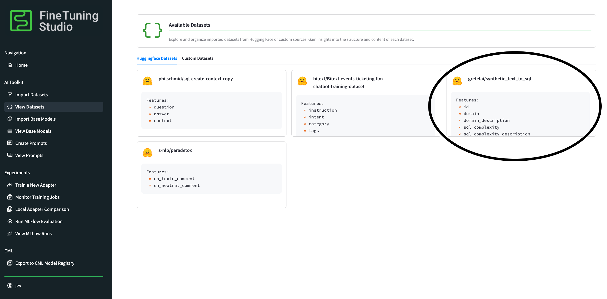

### Importing the Base Model

For the Mistral 7b model, we will use the `unsloth/mistral-7b-instruct-v0.3` model. As for the datasets, we can import the model on the **Import Base Models** page directly by the huggingface ID, and view the successfully imported model on the **View Base Models** page.

*Note: Technically we can also use mistralai’s `mistralai/Mistral-7B-Instruct-v0.3` model directly, but this is a [gated model on Huggingface](https://huggingface.co/mistralai/Mistral-7B-Instruct-v0.3) that requires special access to the model. In order to use the mistralai-provided model, a user would need to provide the Huggingface access token to the Studio when configuring the studio, and then acquire access to the gated model on HF Hub. Once both of these steps are complete, the studio will be able to access any gated model tied to the access token. We are avoiding this step in this walkthrough and opting to use the `unsloth` non-gated model for simplicity of the example.*

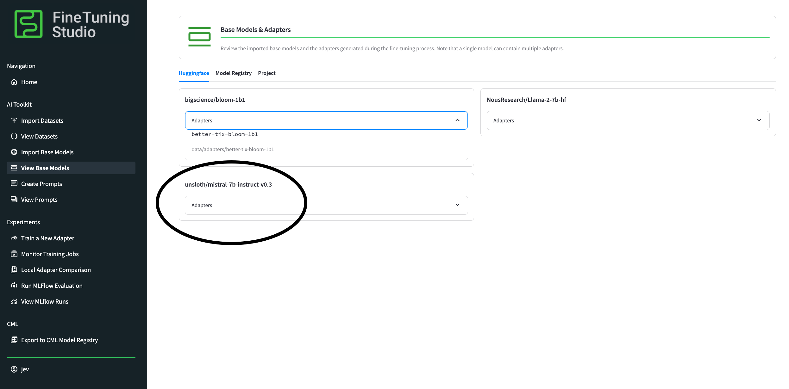

### Creating a Training Prompt

We need to create a training prompt “template” to help provide structure to the data that we will pass to the training job. Prompts are tied to individual datasets, because prompts are able to use dataset “features” as part of the prompt template. In the context of the Fine Tuning Studio, a **Prompt Template** is the “input” component of the prompt, and the **Completion Template** is the part of the “output” that we would like to train the model on. For autoregressive Causal LM models, during *training*, we will pass both the prompt template and the completion template to the model so the model can learn the answer. During *evaluation*, we do *not* provide the completion template, as this is the component that we would like the LLM to generate on its own.

For our prompt template, we want to train the model to generate the `sql` feature of the `gretelai/synthetic_text_to_sql` dataset. Lucky for us, this dataset also provides a ton of useful features to help the model during training, which we will add to the prompt. We will also add a sentence to the beginning of the prompt template to help level set the model’s expectations of the instruction.

When creating a new prompt, the Prompt Template and Completion Template fields will automatically populate based on some internal heuristics, but we can change these templates to whatever we want. In this case, we will be changing both, and ensure that the `sql` dataset feature is part of the Completion Template.

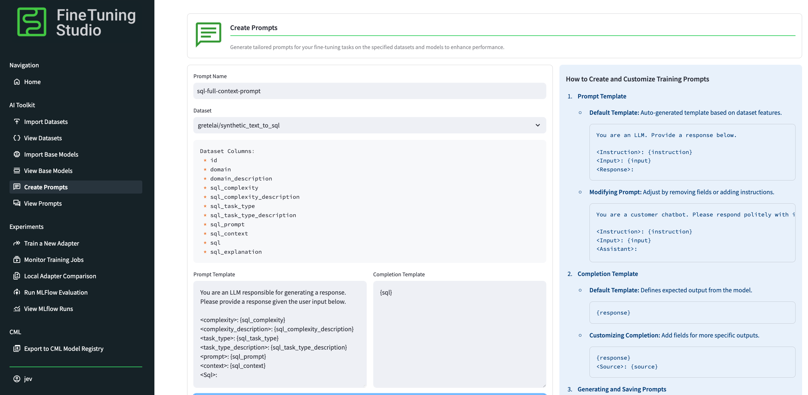

As a sanity check, we can use the prompts **Generate Prompt Example** feature as a sanity check to make sure we’ve constructed our prompt correctly. We are able to see the prompt fed into training, as well as the split/separated Prompt/Completion templates. Once satisfied, we can **Create Prompt** and view the prompt on the **View Prompts** page.

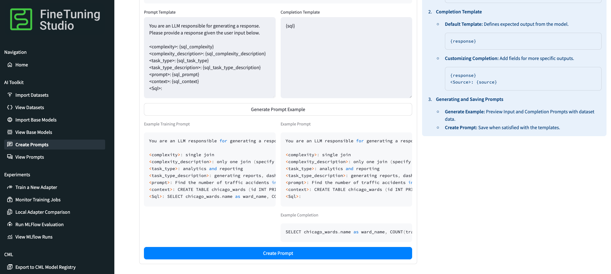

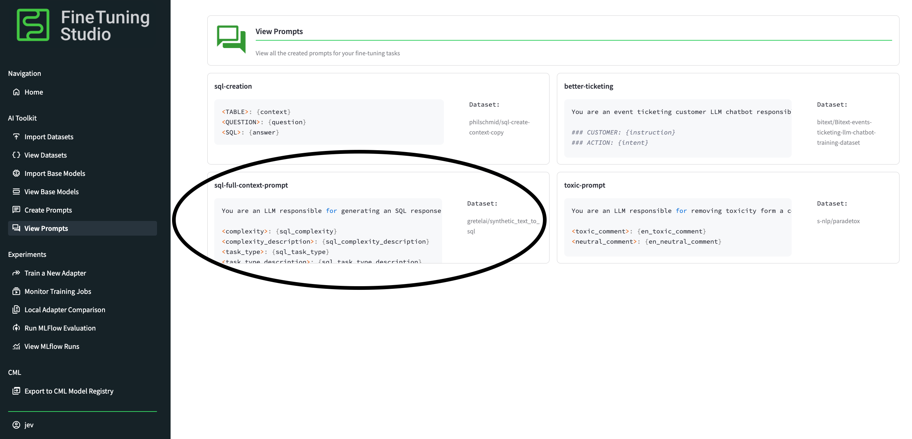

-----

## Training the Model

Now that we’ve configured everything we need to and imported all components into the Studio needed for training, we can kick off a training job. For the sake of this example, we will be training on one GPU, and training on a small portion of the dataset to speed up training. We will only train for one epoch (one pass through the dataset).

### Train a new Adapter

On the **Train a New Adapter** page, we can configure all of our inputs to the training job. Our adapter name will be `better-sql-mistral`. Our base model is the `unsloth/mistral-7b-instruct-v0.3` model. Our dataset is the `gretelai/synthetic_text_to_sql` model. Once the dataset is selected, all prompts tied to this dataset can be selected, and in this case we will choose the `sql-full-context-prompt` template that we previously created.

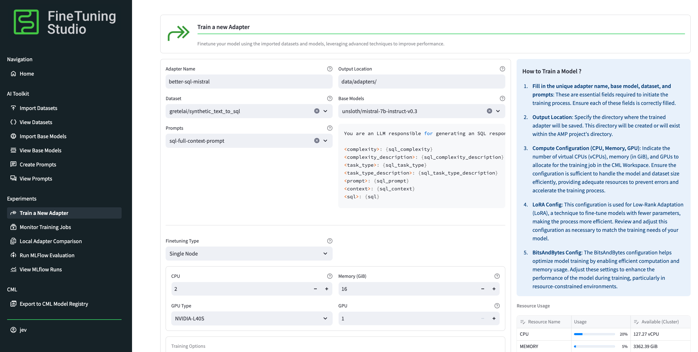

Because this is such a substantially large dataset, we will reduce the total dataset fraction down to only a small percentage of the total dataset. This will randomly sample the dataset down to a smaller size for training. We will also only train for 1 epoch. Lastly, we will remove any evaluation strategies present in the `Training Arguments` advanced training options, to save on GPU memory during evaluation (and since we are only running one epoch). We will accept the default LoRA config and BitsAndBytes config that will be used for training. Once we’re ready, we can hit **Start Job** to kick off a fine tuning job with all of our configurations.

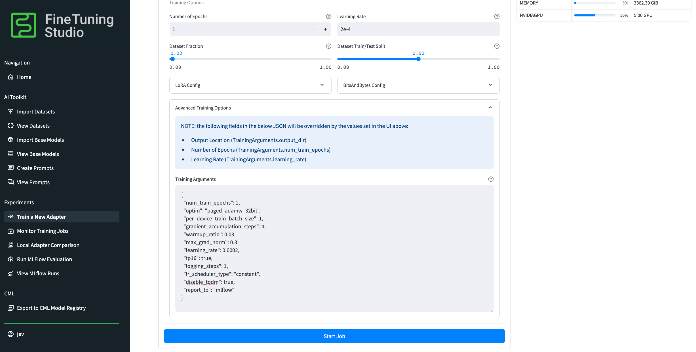

### Monitoring the Training Job

At this point, Cloudera ML will dispatch workers to run your training job. We can monitor the performance of the training job on the **Monitor Training Jobs** page. There are deep links to both the Cloudera ML Job and Cloudera ML Experiment that are used to track training. By opening the Cloudera ML Job link, a user is able to see the log outputs of a training job, which can be useful to help debug issues if a training job fails. For more help on debugging training jobs, see \[training jobs\](TODO INSERT LINK) documentation. Some failures are transient and can be resolved by simply restarting the Job that was created.

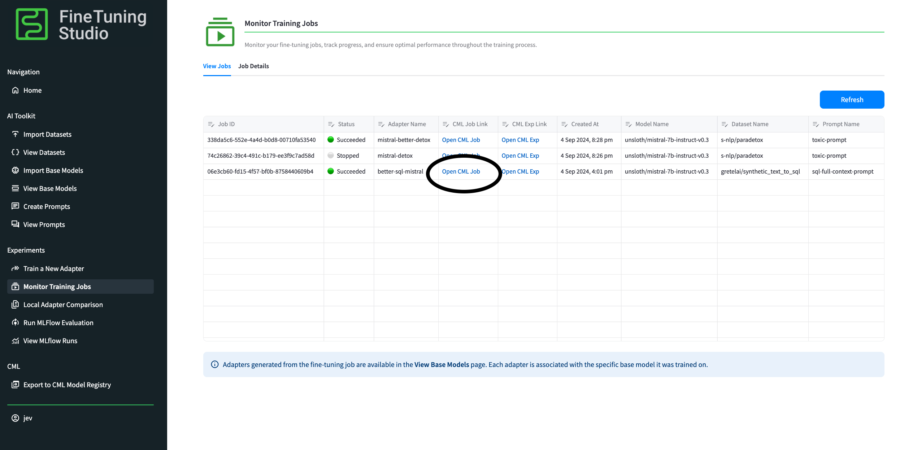

We can monitor the performance of the training job (loss, grad\_norm, etc.) from the  **Open Cloudera ML Exp** link on the training job. Alternatively, once an adapter checkpoint becomes available, we can monitor the performance of the adapter directly from within the  **Job Details** tab of the **Monitor Training Jobs** page.

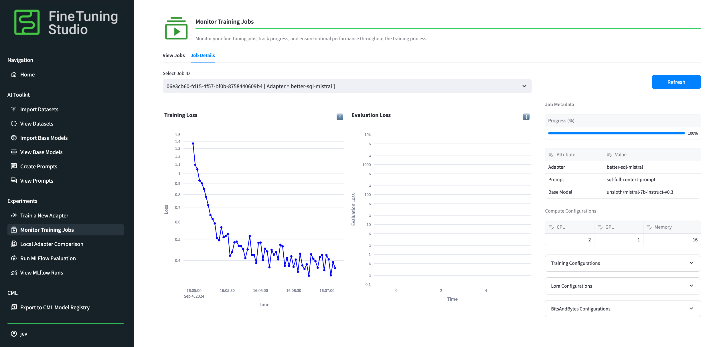

And that’s all there is to it\! Once this training job completes, the adapter will become available for viewing, testing and evaluation. We can confirm the adapter was added to the Studio successfully after training by going back to the **View Base Models** page and confirming the existence of our new adapter.

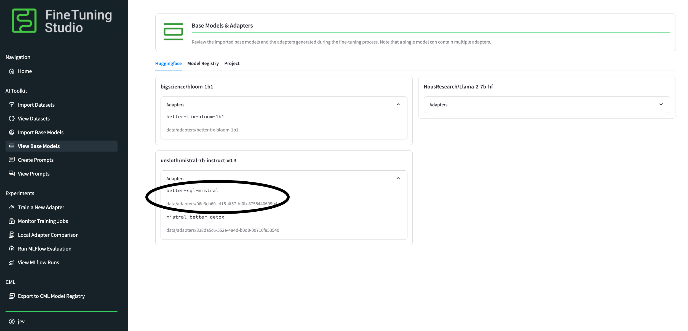

-----

## Evaluating the Model Adapter

Now that we’ve finished training our new adapter, it’s time to put it to the test and see how performant the adapter is at what it was trained to do.

### Local Adapter Comparison

The Fine Tuning Studio ships with a powerful “spot checker” tool to run local inference on a base model and any trained adapters for the model. This allows us to quickly see if the adapter is performing as expected. Given that we did not train for a long time, we aren’t expecting a perfect match, but we are expecting that the adapter performs better than the base model.

On the **Local Adapter Comparison** page, we will load in our `unsloth/mistral-7b-instruct-v0.3` model and the newly created `better-sql-mistral` adapter. Once selected, the prompt and dataset that was used to train this adapter (our `sql-full-context-prompt` prompt, which is tied to the `gretelai/synthetic_text_to_sql` dataset) is automatically populated with the prompt template. In order to test out the adapter, we can use the **Generate Prompt Example** feature that will select a random entry from the trained dataset and create an **Input Prompt** and expected **Completion Prompt**. This is the expected output of the model given the input. If you aren’t happy with the example that was created, you can just select **Generate Prompt Example** again to generate a new example.

Once satisfied, you can **Generate** the model output, which will do the following:

* Load the model and adapters into memory  
* Run inference on the base model given the input prompt  
* Run inference on the base model and the adapter given the input prompt

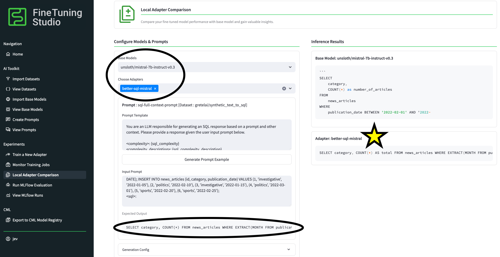

As shown above, the model seems to be performing much better with our trained adapter in providing properly formatted SQL which more closely matches the expected output\!

### Running MLFLow Evaluations

Once we’ve confirmed in the **Local Adapter Comparison** page that the model training seems to have been completed successfully, we can perform more extensive evaluations using the Studio’s deep MLFLow integrations. On the **Run MLFlow Evaluation** page, we can select our base model, trained adapter, dataset and prompt that we’d like to use for evaluation.

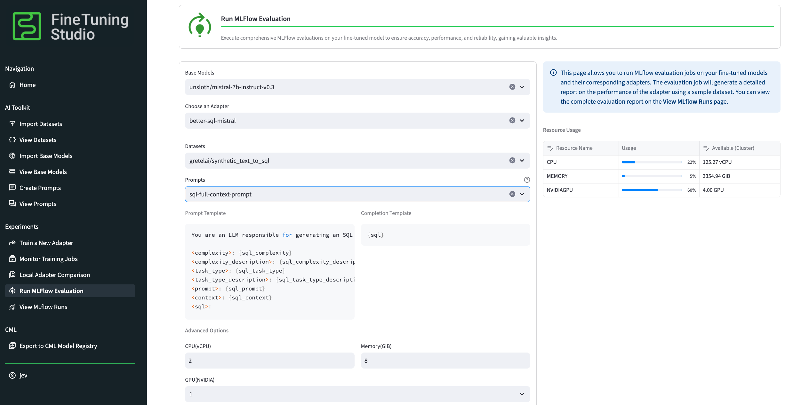

Similarly to training jobs, we can view MLFLow evaluation jobs directly in the UI and follow deep links to the corresponding Cloudera ML Jobs.

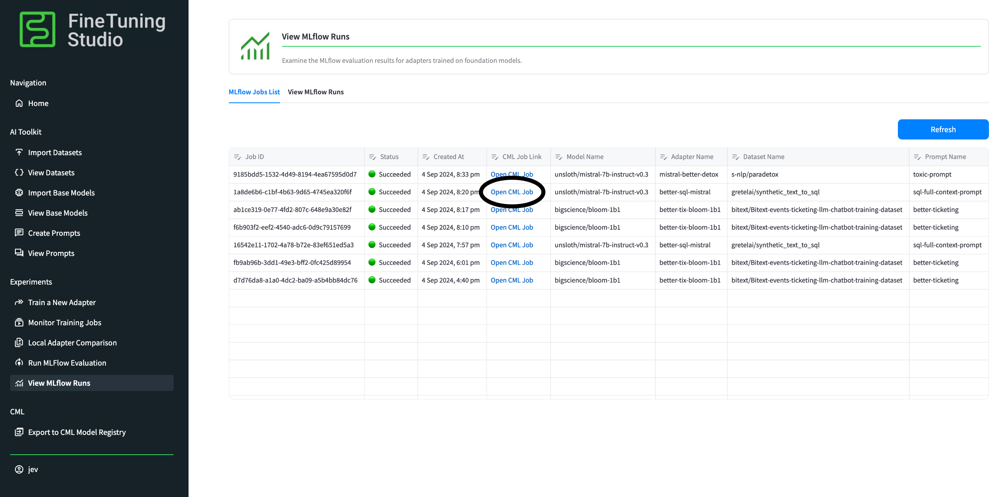

Finally, once the evaluation job is complete, we can see the generated model outputs for the entire evaluation jobs in the **View MLFlow Runs** section. As shown below, our generated outputs are, for the most part, very closely matching the expected output (or the “target”)\! Even though we only trained on a very small subset of the dataset, we provided enough context in the prompts, and had a strong enough base model, to generate a PEFT adapter that capable of some serious heavy lifting.

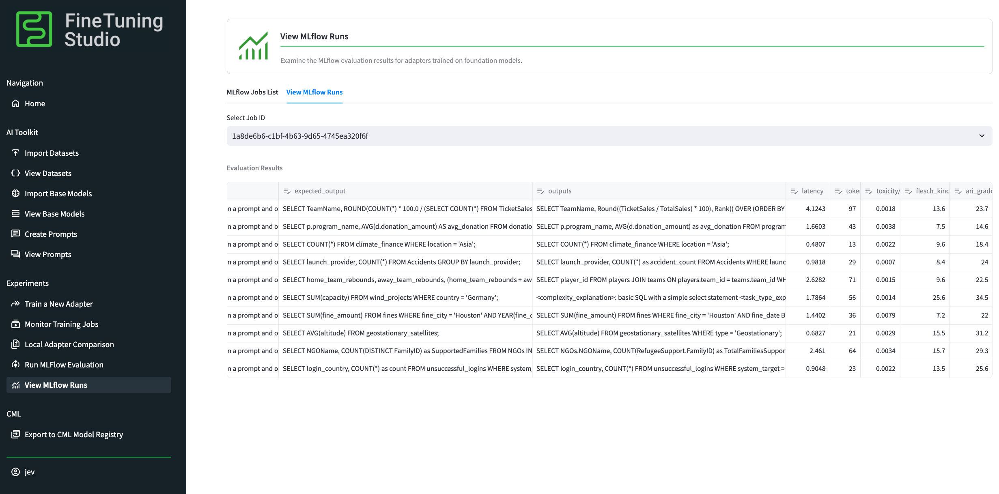

-----

## Exporting the Adapter

Once a training job completes, the adapter files (the final checkpoint) is automatically written to the output directory specified in the training job input. Also, if the training job completes successfully, the trained adapter is automatically added into the Fine Tuning Studio ecosystem so it can be used for testing (as we see above). Going to **View Base Models** and expanding the **Adapters** drop-down for the targeted `unsloth/mistral-7b-instruct-v0.3` model, we see that our `better-sql-mistral` adapter is stored under `data/adapters/06e3cb60-fd15-4f57-bf0b-8758440609b4` from the project directory. We can use this adapter in any custom evaluation scripts form within the project, or further export it to other Cloudera ML integrations (such as Model Registry).