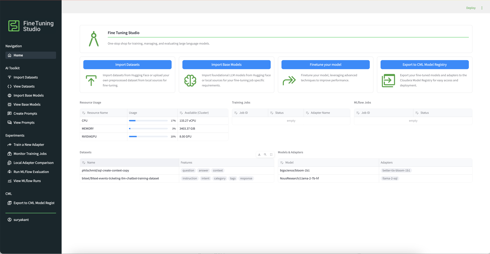
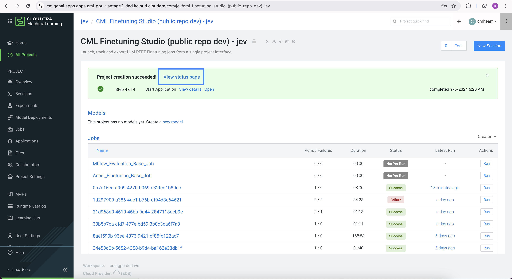
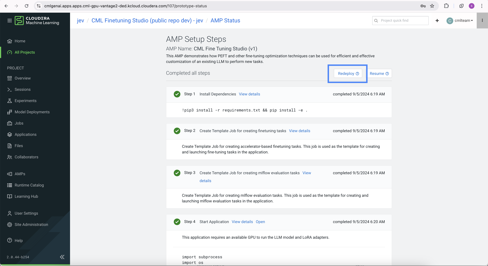
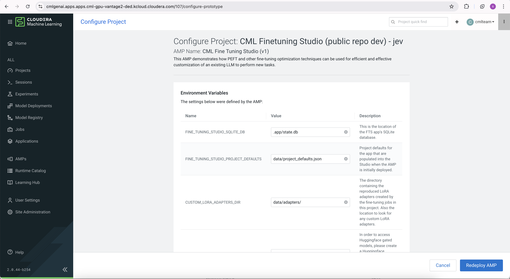
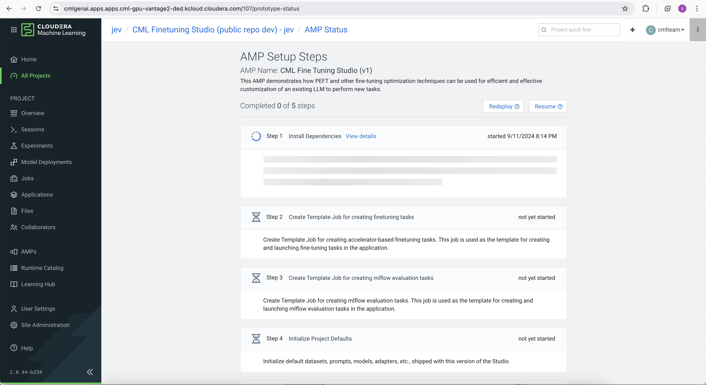

# Updating the Fine Tuning Studio 

This guide will walk you through the steps to update the Fine Tuning Studio AMP deployed in your Cloudera Machine Learning (CML) workspace. The AMP can be updated directly from the CML workspace interface, using the "View AMP Status" page, the "Configure Redeployment" page, and the "Redeploy" button.

## AMP Update Warning

If you see a warning like the one shown below on the home page of the Fine Tuning Studio, it means that your AMP is out of date, and you need to follow the steps below to redeploy and update the AMP.

After completing the redeployment steps, the warning will disappear, as shown in the following image:

## Steps to Update the Fine Tuning Studio AMP

### 1. Open the Project in CML Workspace

To begin, navigate to the CML workspace where the Fine Tuning Studio AMP is deployed. Follow these steps:

- Log in to the CML platform.
- Navigate to the **Projects** section from the dashboard.
- Find and click on the project where the AMP is currently deployed.

### 2. Upgrade the AMP

Once you are inside the project, follow these steps to check the current status of the Fine Tuning Studio AMP:

1. **Open the AMP Status Page**: 
   - Inside the project, locate and click on the **View Status Page** button. This button will take you to the status page of the AMP.   
   

2. **Click on the Redeploy Button**:
   - On the AMP status page, locate the **Redeploy** button. Clicking this button will initiate the redeployment process.
   
   

3. **Configure the AMP for Redeployment**:
   - Once you click the **Redeploy** button, you will be prompted to configure your AMP again for redeployment. Ensure that all necessary configurations are set as per your deployment requirements.
   
   

4. **Monitor the Redeployment Process**:
   - After configuring the AMP, click **Redeploy**. The AMP will begin redeploying, and you can monitor the progress. The redeployment process might take a few minutes.
   
   

5. **Wait for the Update to Complete**:
   - Once the redeployment is completed, the AMP will be updated.

### 3. Verify the Update

Once the AMP has been successfully updated, verify that everything is working as expected:

- **Run Tests**: If necessary, run a few sample workflows in the AMP to confirm that the update has been successfully applied and that everything is functioning properly.
- **Verify Warning Disappearance**: After redeploying, check that the upgrade warning is no longer visible on the home page.

## Conclusion

You have successfully updated the Fine Tuning Studio AMP in your CML workspace. By following these steps, you ensure that the AMP is running the latest version and includes all the new features and bug fixes. Always monitor the AMP status for any future updates.

